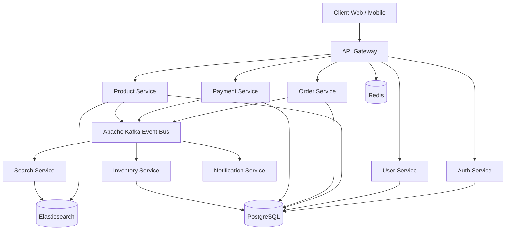

# ShopGrid

**ShopGrid** is a pet project for learning and practicing microservice architecture with Java and Spring Boot.

The goal of this project is not to build a real production marketplace, but to create a realistic backend system that demonstrates modern backend patterns: service decomposition, API Gateway, authentication, event-driven communication, distributed tracing, metrics, centralized logs, Docker, Kubernetes, and Helm.

## Project Idea

ShopGrid is an e-commerce platform split into several independent services.

Each service has its own responsibility and can be developed, tested, and deployed separately.

## Architecture



## Main Goals

- Learn how to design a microservice system
- Practice Spring Boot and Spring Cloud
- Use API Gateway for request routing
- Implement JWT-based authentication
- Use Kafka for asynchronous communication
- Use PostgreSQL as a database per service
- Add Redis for cache and rate limiting
- Add Elasticsearch for product search
- Add Docker Compose for local development
- Add Kubernetes and Helm for deployment practice
- Add observability with metrics, logs, and tracing

## Services

### API Gateway

Routes external requests to internal services.

Planned features:

- Service routing
- JWT validation
- Rate limiting
- Centralized entry point for clients

Tech:

- Spring Cloud Gateway
- Redis
- JWT

### Auth Service

Responsible for authentication and authorization.

Planned features:

- User registration
- Login
- JWT token generation
- Password hashing
- Basic role-based access control

Tech:

- Spring Boot
- Spring Security
- PostgreSQL
- JWT

### User Service

Responsible for user profile data.

Planned features:

- User profile management
- User roles
- User status
- Basic user administration

Tech:

- Spring Boot
- PostgreSQL

### Product Service

Responsible for product catalog management.

Planned features:

- Create, update, and delete products
- Product categories
- Product details
- Publish product-related events

Tech:

- Spring Boot
- PostgreSQL
- Kafka

### Search Service

Responsible for full-text product search.

Planned features:

- Index products from Kafka events
- Search products by name and description
- Filter products by category and price

Tech:

- Spring Boot
- Elasticsearch
- Kafka

### Order Service

Responsible for order creation and order lifecycle.

Planned features:

- Create orders
- Change order status
- Publish `order.created` events
- Implement a simple saga-style flow with payment and inventory

Tech:

- Spring Boot
- PostgreSQL
- Kafka
- Resilience4j

### Payment Service

Responsible for payment simulation.

Planned features:

- Simulate payment processing
- Support idempotency keys
- Publish `payment.completed` and `payment.failed` events

Tech:

- Spring Boot
- PostgreSQL
- Kafka
- Resilience4j

### Inventory Service

Responsible for stock management.

Planned features:

- Store product stock
- Reserve stock
- Release stock
- Use optimistic locking

Tech:

- Spring Boot
- PostgreSQL
- Kafka

### Notification Service

Responsible for user notifications.

Planned features:

- Listen to Kafka events
- Send email-like notifications
- Store notification history
- Use notification templates

Tech:

- Spring Boot
- Kafka

### Admin Service

Responsible for simple admin operations.

Planned features:

- View users
- View orders
- View payments
- Basic reports

Tech:

- Spring Boot
- PostgreSQL

## Technology Stack

### Backend

- Java
- Spring Boot
- Spring Web
- Spring Security
- Spring Data JPA
- Spring Cloud Gateway
- Spring Cloud OpenFeign
- Resilience4j

### Databases and Storage

- PostgreSQL
- Redis
- Elasticsearch

### Messaging

- Apache Kafka

### Infrastructure

- Docker
- Docker Compose
- Kubernetes
- Helm

### Observability

- Prometheus
- Grafana
- Jaeger
- ELK Stack

## Why These Technologies Are Used

### Docker

Used to run services and infrastructure locally in containers.

### Docker Compose

Used for local development, so PostgreSQL, Redis, Kafka, and Elasticsearch can be started with one command.

### Kubernetes

Used to practice container orchestration and deployment.

### Helm

Used to package and manage Kubernetes manifests in a cleaner way.

### Prometheus

Used to collect metrics from services, such as request count, error count, response time, and memory usage.

### Grafana

Used to visualize Prometheus metrics in dashboards.

### Jaeger

Used for distributed tracing. It helps understand how one request travels between multiple services.

### ELK Stack

Used for centralized logging. Instead of checking logs in every service separately, all logs can be collected and searched in one place.

### Resilience4j

Used for fault tolerance between services.

Planned patterns:

- Timeout
- Retry
- Circuit breaker

## Repository Structure

Planned structure:

```text
shopgrid/
├── api-gateway/
├── auth-service/
├── user-service/
├── product-service/
├── search-service/
├── order-service/
├── payment-service/
├── inventory-service/
├── notification-service/
├── admin-service/
├── common/
├── infrastructure/
│   ├── docker-compose/
│   ├── kubernetes/
│   └── helm/
├── docs/
└── README.md
```

## Development Plan

### Stage 1: Foundation

- [ ] Create repository structure
- [ ] Add common Gradle or Maven configuration
- [ ] Add Docker Compose for PostgreSQL, Kafka, Redis, and Elasticsearch
- [ ] Create API Gateway
- [ ] Create Auth Service
- [ ] Implement JWT authentication

### Stage 2: Core E-commerce

- [ ] Create User Service
- [ ] Create Product Service
- [ ] Create Order Service
- [ ] Create Inventory Service
- [ ] Add basic REST APIs
- [ ] Add PostgreSQL database per service

### Stage 3: Events

- [ ] Add Kafka
- [ ] Publish `order.created`
- [ ] Publish `payment.completed`
- [ ] Publish `stock.reserved`
- [ ] Add Notification Service
- [ ] Add Search Service indexing from Kafka events

### Stage 4: Reliability

- [ ] Add Resilience4j
- [ ] Add timeout
- [ ] Add retry
- [ ] Add circuit breaker
- [ ] Add idempotency for payment requests

### Stage 5: Observability

- [ ] Add structured logging
- [ ] Add Prometheus metrics
- [ ] Add Grafana dashboard
- [ ] Add Jaeger tracing
- [ ] Add ELK logging setup

### Stage 6: Deployment Practice

- [ ] Add Dockerfiles for services
- [ ] Add Kubernetes manifests
- [ ] Add Helm charts
- [ ] Deploy locally with Minikube or Kind

## Current Status

This project is in the planning and initial development stage.

## Note

This is a pet project created for learning purposes.

The architecture is intentionally bigger than a simple CRUD application because the goal is to practice real-world backend engineering concepts step by step.

