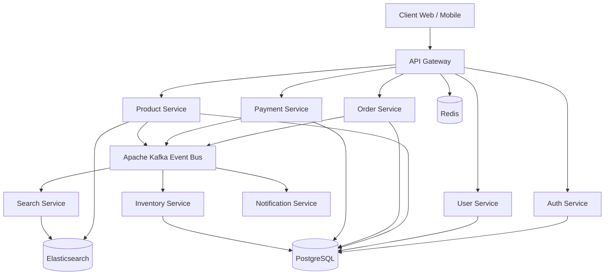

# ShopGrid

**ShopGrid** is a pet project for learning and practicing microservice architecture with Java and Spring Boot.

The goal of this project is not to build a real production marketplace, but to create a realistic backend system that demonstrates modern backend patterns: service decomposition, API Gateway, authentication, event-driven communication, distributed tracing, metrics, centralized logs, Docker, Kubernetes, and Helm.

## Project Idea

ShopGrid is an e-commerce platform split into several independent services.

Each service has its own responsibility and can be developed, tested, and deployed separately.

## Architecture


```mermaid
flowchart TD
    Client[Client Web / Mobile] --> Gateway[API Gateway]

    Gateway --> Auth[Auth Service]
    Gateway --> User[User Service]
    Gateway --> Product[Product Service]
    Gateway --> Order[Order Service]
    Gateway --> Payment[Payment Service]

    Order --> Kafka[Apache Kafka Event Bus]
    Payment --> Kafka
    Product --> Kafka

    Kafka --> Inventory[Inventory Service]
    Kafka --> Notification[Notification Service]
    Kafka --> Search[Search Service]

    Product --> Elasticsearch[(Elasticsearch)]
    Search --> Elasticsearch

    Auth --> PostgreSQL[(PostgreSQL)]
    User --> PostgreSQL
    Product --> PostgreSQL
    Order --> PostgreSQL
    Payment --> PostgreSQL
    Inventory --> PostgreSQL

    Gateway --> Redis[(Redis)]
```

## Main Goals

- Learn how to design a microservice system
- Practice Spring Boot and Spring Cloud
- Use API Gateway for request routing
- Implement JWT-based authentication
- Use Kafka for asynchronous communication
- Use PostgreSQL as a database per service
- Add Redis for cache and rate limiting
- Add Elasticsearch for product search
- Add Docker Compose for local development
- Add Kubernetes and Helm for deployment practice
- Add observability with metrics, logs, and tracing

## Services

### API Gateway

Routes external requests to internal services.

Planned features:

- Service routing
- JWT validation
- Rate limiting
- Centralized entry point for clients

Tech:

- Spring Cloud Gateway
- Redis
- JWT

### Auth Service

Responsible for authentication and authorization.

Planned features:

- User registration
- Login
- JWT token generation
- Password hashing
- Basic role-based access control

Tech:

- Spring Boot
- Spring Security
- PostgreSQL
- JWT

### User Service

Responsible for user profile data.

Planned features:

- User profile management
- User roles
- User status
- Basic user administration

Tech:

- Spring Boot
- PostgreSQL

### Product Service

Responsible for product catalog management.

Planned features:

- Create, update, and delete products
- Product categories
- Product details
- Publish product-related events

Tech:

- Spring Boot
- PostgreSQL
- Kafka

### Search Service

Responsible for full-text product search.

Planned features:

- Index products from Kafka events
- Search products by name and description
- Filter products by category and price

Tech:

- Spring Boot
- Elasticsearch
- Kafka

### Order Service

Responsible for order creation and order lifecycle.

Planned features:

- Create orders
- Change order status
- Publish `order.created` events
- Implement a simple saga-style flow with payment and inventory

Tech:

- Spring Boot
- PostgreSQL
- Kafka
- Resilience4j

### Payment Service

Responsible for payment simulation.

Planned features:

- Simulate payment processing
- Support idempotency keys
- Publish `payment.completed` and `payment.failed` events

Tech:

- Spring Boot
- PostgreSQL
- Kafka
- Resilience4j

### Inventory Service

Responsible for stock management.

Planned features:

- Store product stock
- Reserve stock
- Release stock
- Use optimistic locking

Tech:

- Spring Boot
- PostgreSQL
- Kafka

### Notification Service

Responsible for user notifications.

Planned features:

- Listen to Kafka events
- Send email-like notifications
- Store notification history
- Use notification templates

Tech:

- Spring Boot
- Kafka

### Admin Service

Responsible for simple admin operations.

Planned features:

- View users
- View orders
- View payments
- Basic reports

Tech:

- Spring Boot
- PostgreSQL

## Technology Stack

### Backend

- Java
- Spring Boot
- Spring Web
- Spring Security
- Spring Data JPA
- Spring Cloud Gateway
- Spring Cloud OpenFeign
- Resilience4j

### Databases and Storage

- PostgreSQL
- Redis
- Elasticsearch

### Messaging

- Apache Kafka

### Infrastructure

- Docker
- Docker Compose
- Kubernetes
- Helm

### Observability

- Prometheus
- Grafana
- Jaeger
- ELK Stack

## Why These Technologies Are Used

### Docker

Used to run services and infrastructure locally in containers.

### Docker Compose

Used for local development, so PostgreSQL, Redis, Kafka, and Elasticsearch can be started with one command.

### Kubernetes

Used to practice container orchestration and deployment.

### Helm

Used to package and manage Kubernetes manifests in a cleaner way.

### Prometheus

Used to collect metrics from services, such as request count, error count, response time, and memory usage.

### Grafana

Used to visualize Prometheus metrics in dashboards.

### Jaeger

Used for distributed tracing. It helps understand how one request travels between multiple services.

### ELK Stack

Used for centralized logging. Instead of checking logs in every service separately, all logs can be collected and searched in one place.

### Resilience4j

Used for fault tolerance between services.

Planned patterns:

- Timeout
- Retry
- Circuit breaker

## Repository Structure

Planned structure:

```text
shopgrid/
├── api-gateway/
├── auth-service/
├── user-service/
├── product-service/
├── search-service/
├── order-service/
├── payment-service/
├── inventory-service/
├── notification-service/
├── admin-service/
├── common/
├── infrastructure/
│   ├── docker-compose/
│   ├── kubernetes/
│   └── helm/
├── docs/
└── README.md
```

## Development Plan

### Stage 1: Foundation

- [x] Create repository structure
- [x] Add common Gradle or Maven configuration
- [x] Add Docker Compose for PostgreSQL, Kafka, Redis, and Elasticsearch
- [x] Create API Gateway
- [x] Create Auth Service
- [x] Implement JWT authentication

### Stage 2: Core E-commerce

- [x] Create User Service
- [x] Create Product Service
- [x] Create Order Service
- [x] Create Inventory Service
- [x] Add basic REST APIs
- [x] Add PostgreSQL database per service

### Stage 3: Events

- [x] Add Kafka
- [x] Publish `order.created`
- [x] Publish `payment.completed`
- [x] Publish `stock.reserved`
- [x] Add Notification Service
- [x] Add Search Service indexing from Kafka events

### Stage 4: Reliability

- [x] Add Resilience4j
- [x] Add timeout
- [x] Add retry
- [x] Add circuit breaker
- [x] Add idempotency for payment requests

### Stage 5: Observability

- [ ] Add structured logging
- [ ] Add Prometheus metrics
- [ ] Add Grafana dashboard
- [ ] Add Jaeger tracing
- [ ] Add ELK logging setup

### Stage 6: Deployment Practice

- [ ] Add Dockerfiles for services
- [ ] Add Kubernetes manifests
- [ ] Add Helm charts
- [ ] Deploy locally with Minikube or Kind

## Getting Started

### Prerequisites

Make sure you have the following installed:

- [Docker](https://www.docker.com/get-started) (version 20+)
- [Docker Compose](https://docs.docker.com/compose/install/) (version 2+)
- [Java 21](https://adoptium.net/)
- [Gradle](https://gradle.org/install/) (or use the included `./gradlew` wrapper)

### 1. Clone the repository

```bash
git clone https://github.com/rea1dias/ShopGrid.git
cd ShopGrid
```

### 2. Start infrastructure

This starts PostgreSQL, Redis, Kafka, Elasticsearch, Kafka UI, and Kibana:

```bash
cd infrastructure/docker-compose
docker-compose up -d
```

Wait about 30 seconds for all services to be ready.

### 3. Build all services

Go back to the project root and build:

```bash
cd ../..
./gradlew build -x test
```

### 4. Run a service

Each service can be started individually. For example, to start the Auth Service:

```bash
cd auth-service
../gradlew bootRun
```

Or run any service from IntelliJ IDEA by running its `Application` main class.

### Infrastructure ports

| Service        | URL                          |
|----------------|------------------------------|
| API Gateway    | http://localhost:8080        |
| Auth Service   | http://localhost:8081        |
| User Service   | http://localhost:8082        |
| Product Service| http://localhost:8083        |
| Order Service  | http://localhost:8084        |
| Payment Service| http://localhost:8085        |
| Inventory Service | http://localhost:8086     |
| Notification Service | http://localhost:8087  |
| Search Service | http://localhost:8088        |
| Admin Service  | http://localhost:8089        |
| PostgreSQL     | localhost:5432               |
| Redis          | localhost:6379               |
| Kafka          | localhost:9092               |
| Kafka UI       | http://localhost:1212        |
| Elasticsearch  | http://localhost:9200        |
| Kibana         | http://localhost:5601        |

### Quick API test

Register a user:

```bash
curl -X POST http://localhost:8080/api/auth/register \
  -H "Content-Type: application/json" \
  -d '{"email": "test@example.com", "password": "password123", "firstName": "John", "lastName": "Doe"}'
```

Login:

```bash
curl -X POST http://localhost:8080/api/auth/login \
  -H "Content-Type: application/json" \
  -d '{"email": "test@example.com", "password": "password123"}'
```

### Stop infrastructure

```bash
cd infrastructure/docker-compose
docker-compose down
```

To also remove saved data:

```bash
docker-compose down -v
```

## Current Status

Stages 1, 2, and 3 are complete. All core services are implemented and running. Stage 4 (Reliability) is in progress.

## Note

This is a pet project created for learning purposes.

The architecture is intentionally bigger than a simple CRUD application because the goal is to practice real-world backend engineering concepts step by step.
