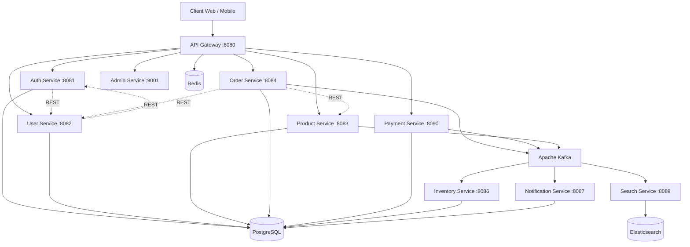

# ShopGrid

**ShopGrid** is a pet project for learning and practicing microservice architecture with Java and Spring Boot.

The goal of this project is not to build a real production marketplace, but to create a realistic backend system that demonstrates modern backend patterns: service decomposition, API Gateway, authentication, event-driven communication, distributed tracing, metrics, Docker, and fault tolerance.

## Project Idea

ShopGrid is an e-commerce platform split into several independent services.

Each service has its own responsibility and can be developed, tested, and deployed separately.

## Architecture


```mermaid
flowchart TD
    Client[Client Web / Mobile] --> Gateway[API Gateway :8080]

    Gateway --> Auth[Auth Service :8081]
    Gateway --> User[User Service :8082]
    Gateway --> Product[Product Service :8083]
    Gateway --> Order[Order Service :8084]
    Gateway --> Payment[Payment Service :8090]
    Gateway --> Admin[Admin Service :9001]

    Order --> Kafka[Apache Kafka]
    Payment --> Kafka
    Product --> Kafka

    Kafka --> Inventory[Inventory Service :8086]
    Kafka --> Notification[Notification Service :8087]
    Kafka --> Search[Search Service :8089]

    Search --> Elasticsearch[(Elasticsearch)]

    Auth --> PostgreSQL[(PostgreSQL)]
    User --> PostgreSQL
    Product --> PostgreSQL
    Order --> PostgreSQL
    Payment --> PostgreSQL
    Inventory --> PostgreSQL
    Notification --> PostgreSQL

    Gateway --> Redis[(Redis)]

    Auth -.->|REST| User
    User -.->|REST| Auth
    Order -.->|REST| Product
    Order -.->|REST| User
```

## Technology Stack

### Backend
- Java 17
- Spring Boot 3.x
- Spring Web
- Spring Security
- Spring Data JPA
- Spring Cloud Gateway
- Resilience4j (CircuitBreaker, Retry, TimeLimiter)

### Databases and Storage
- PostgreSQL (separate DB per service)
- Redis (rate limiting)
- Elasticsearch (product search)

### Messaging
- Apache Kafka

### Observability
- Prometheus (metrics collection)
- Grafana (metrics visualization)
- Jaeger (distributed tracing)

### Infrastructure
- Docker
- Docker Compose

## Services

| Service | Port | Description |
|---------|------|-------------|
| API Gateway | 8080 | Routes requests, JWT validation, rate limiting |
| Auth Service | 8081 | Registration, login, JWT tokens |
| User Service | 8082 | User profiles |
| Product Service | 8083 | Product catalog, categories |
| Order Service | 8084 | Order creation and lifecycle |
| Payment Service | 8090 | Payment simulation with idempotency |
| Inventory Service | 8086 | Stock management |
| Notification Service | 8087 | Email-like notifications via Kafka |
| Search Service | 8089 | Full-text product search via Elasticsearch |
| Admin Service | 9001 | Admin operations |

## Infrastructure Ports

| Service | URL |
|---------|-----|
| API Gateway | http://localhost:8080 |
| Kafka UI | http://localhost:1212 |
| Elasticsearch | http://localhost:9200 |
| Kibana | http://localhost:5601 |
| Prometheus | http://localhost:9090 |
| Grafana | http://localhost:3000 |
| Jaeger UI | http://localhost:16686 |
| PostgreSQL | localhost:5432 |
| Redis | localhost:6379 |
| Kafka | localhost:9092 |

## Getting Started

### Prerequisites

- [Docker](https://www.docker.com/get-started) (version 20+)
- [Docker Compose](https://docs.docker.com/compose/install/) (version 2+)
- [Java 17](https://adoptium.net/)

### 1. Clone the repository

```bash
git clone https://github.com/rea1dias/ShopGrid.git
cd ShopGrid
```

### 2. Build all services

```bash
./gradlew clean build -x test
```

### 3. Start everything

```bash
docker-compose -f infrastructure/docker-compose/docker-compose.yml up --build -d
```

Wait about 60 seconds for all services to start.

### 4. Verify

```bash
docker ps
```

All containers should be `Up`.

### Stop

```bash
docker-compose -f infrastructure/docker-compose/docker-compose.yml down
```

To also remove saved data:

```bash
docker-compose -f infrastructure/docker-compose/docker-compose.yml down -v
```

## Quick API Test

### Register

```bash
curl -X POST http://localhost:8080/api/auth/register \
  -H "Content-Type: application/json" \
  -d '{"email": "test@example.com", "password": "password123", "firstName": "John", "lastName": "Doe"}'
```

### Login

```bash
curl -X POST http://localhost:8080/api/auth/login \
  -H "Content-Type: application/json" \
  -d '{"email": "test@example.com", "password": "password123"}'
```

### Create Product (use token from login)

```bash
curl -X POST http://localhost:8080/api/products \
  -H "Authorization: Bearer <token>" \
  -H "Content-Type: application/json" \
  -d '{"name": "iPhone 15", "price": 999.99, "description": "Apple iPhone 15", "categoryId": 1}'
```

### Create Order

```bash
curl -X POST http://localhost:8080/api/orders \
  -H "Authorization: Bearer <token>" \
  -H "Content-Type: application/json" \
  -d '{"items": [{"productId": "<product-id>", "quantity": 1}]}'
```

## Observability

### Grafana Dashboards
1. Open http://localhost:3000 (admin/admin)
2. Go to Dashboards → Import
3. Enter ID: `19004` → Load
4. Select Prometheus datasource → Import

### Jaeger Tracing
1. Open http://localhost:16686
2. Select a service from dropdown
3. Click **Find Traces**

## Development Plan

### Stage 1: Foundation
- [x] API Gateway with JWT validation and rate limiting
- [x] Auth Service with JWT access/refresh tokens
- [x] Docker Compose for infrastructure

### Stage 2: Core E-commerce
- [x] User, Product, Order, Inventory, Payment services
- [x] Separate PostgreSQL database per service
- [x] REST APIs

### Stage 3: Events
- [x] Kafka event bus
- [x] order.created, payment.completed, stock.reserved events
- [x] Notification Service
- [x] Search Service with Elasticsearch indexing

### Stage 4: Reliability
- [x] Resilience4j CircuitBreaker
- [x] Retry with exponential backoff
- [x] TimeLimiter (timeout)
- [x] Payment idempotency
- [x] Admin Service

### Stage 5: Observability
- [x] Prometheus metrics
- [x] Grafana dashboards
- [x] Jaeger distributed tracing

### Stage 6: Deployment
- [x] Dockerfile for all services
- [x] Docker Compose production setup
- [ ] Kubernetes manifests
- [ ] Helm charts

## Current Status

Stages 1–6 (Docker) are complete. All services are implemented, running in Docker, and fully observable via Prometheus, Grafana, and Jaeger.

## Note

This is a pet project created for learning purposes.

The architecture is intentionally bigger than a simple CRUD application because the goal is to practice real-world backend engineering concepts step by step.