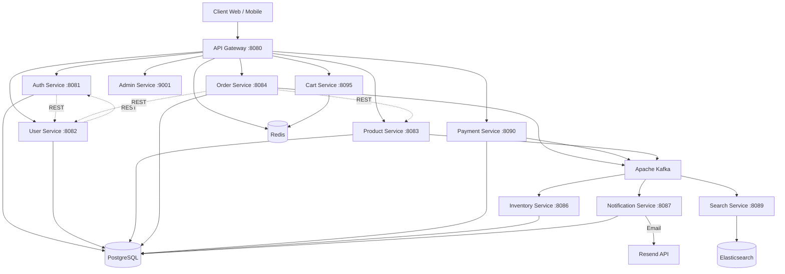

# ShopGrid

**ShopGrid** is a backend pet project built to practice real-world microservice architecture with Java and Spring Boot.

The goal is not to build a production marketplace, but to implement the patterns and infrastructure that real backend engineers work with every day: service decomposition, event-driven communication, fault tolerance, observability, email notifications, and API documentation.

---

## Architecture


```mermaid
flowchart TD
    Client[Client Web / Mobile] --> Gateway[API Gateway :8080]

    Gateway --> Auth[Auth Service :8081]
    Gateway --> User[User Service :8082]
    Gateway --> Product[Product Service :8083]
    Gateway --> Order[Order Service :8084]
    Gateway --> Payment[Payment Service :8090]
    Gateway --> Admin[Admin Service :9001]
    Gateway --> Cart[Cart Service :8095]

    Order --> Kafka[Apache Kafka]
    Payment --> Kafka
    Product --> Kafka

    Kafka --> Inventory[Inventory Service :8086]
    Kafka --> Notification[Notification Service :8087]
    Kafka --> Search[Search Service :8089]

    Search --> Elasticsearch[(Elasticsearch)]

    Auth --> PostgreSQL[(PostgreSQL)]
    User --> PostgreSQL
    Product --> PostgreSQL
    Order --> PostgreSQL
    Payment --> PostgreSQL
    Inventory --> PostgreSQL
    Notification --> PostgreSQL

    Gateway --> Redis[(Redis)]
    Cart --> Redis

    Auth -.->|REST| User
    User -.->|REST| Auth
    Order -.->|REST| Product
    Order -.->|REST| User

    Notification -->|Email| Resend[Resend API]
```

---

## Technology Stack

### Backend
- Java 17
- Spring Boot 3.x
- Spring Web / Spring Security / Spring Data JPA
- Spring Cloud Gateway
- Resilience4j — CircuitBreaker, Retry, TimeLimiter

### Databases & Storage
- PostgreSQL — separate database per service
- Redis — rate limiting, cart storage
- Elasticsearch — full-text product search

### Messaging
- Apache Kafka — event-driven communication between services
- Outbox Pattern — guaranteed event delivery

### Notifications
- Resend — transactional email delivery
- HTML email templates for order confirmation and cancellation

### API Documentation
- SpringDoc OpenAPI — aggregated Swagger UI via API Gateway

### Observability
- Prometheus — metrics collection
- Grafana — metrics visualization
- Jaeger — distributed tracing (OpenTelemetry)

### Infrastructure
- Docker / Docker Compose
- Kubernetes manifests
- Helm charts
- GitHub Actions CI/CD

---

## Services

| Service              | Port | Description                                        |
|----------------------|------|----------------------------------------------------|
| API Gateway          | 8080 | Routing, JWT validation, rate limiting, Swagger UI |
| Auth Service         | 8081 | Registration, login, JWT access/refresh tokens     |
| User Service         | 8082 | User profiles                                      |
| Product Service      | 8083 | Product catalog, categories                        |
| Order Service        | 8084 | Order lifecycle, Outbox Pattern                    |
| Payment Service      | 8090 | Payment simulation with idempotency                |
| Inventory Service    | 8086 | Stock reservation and management                   |
| Notification Service | 8087 | Email notifications via Resend                     |
| Search Service       | 8089 | Full-text product search via Elasticsearch         |
| Cart Service         | 8095 | Shopping cart backed by Redis                      |
| Admin Service        | 9001 | Admin operations                                   |

---

## Infrastructure Ports

| Service       | URL                           |
|---------------|-------------------------------|
| API Gateway   | http://localhost:8080         |
| Swagger UI    | http://localhost:8080/swagger-ui.html |
| Kafka UI      | http://localhost:1212         |
| Elasticsearch | http://localhost:9200         |
| Kibana        | http://localhost:5601         |
| Prometheus    | http://localhost:9090         |
| Grafana       | http://localhost:3000         |
| Jaeger UI     | http://localhost:16686        |
| PostgreSQL    | localhost:5432                |
| Redis         | localhost:6379                |
| Kafka         | localhost:9092                |

---

## Getting Started

### Prerequisites

- [Docker](https://www.docker.com/get-started) 20+
- [Docker Compose](https://docs.docker.com/compose/install/) 2+
- [Java 17](https://adoptium.net/)

### 1. Clone the repository

```bash
git clone https://github.com/rea1dias/ShopGrid.git
cd ShopGrid
```

### 2. Build all services

```bash
./gradlew clean build -x test
```

### 3. Start everything

```bash
docker-compose -f infrastructure/docker-compose/docker-compose.yml up --build -d
```

Wait ~60 seconds for all services to initialize.

### 4. Verify

```bash
docker ps
```

All containers should be `Up`.

### Stop

```bash
docker-compose -f infrastructure/docker-compose/docker-compose.yml down
```

Remove volumes too:

```bash
docker-compose -f infrastructure/docker-compose/docker-compose.yml down -v
```

---

## API Documentation

Aggregated Swagger UI is available at:

```
http://localhost:8080/swagger-ui.html
```

Use the dropdown in the top-right corner to switch between services.

---

## Quick API Test

### Register

```bash
curl -X POST http://localhost:8080/api/auth/register \
  -H "Content-Type: application/json" \
  -d '{"email": "test@example.com", "password": "password123", "firstName": "John", "lastName": "Doe"}'
```

### Login

```bash
curl -X POST http://localhost:8080/api/auth/login \
  -H "Content-Type: application/json" \
  -d '{"email": "test@example.com", "password": "password123"}'
```

### Create Product

```bash
curl -X POST http://localhost:8080/api/products \
  -H "Authorization: Bearer <token>" \
  -H "Content-Type: application/json" \
  -d '{"name": "iPhone 15", "price": 999.99, "description": "Apple iPhone 15", "categoryId": 1}'
```

### Create Order

```bash
curl -X POST http://localhost:8080/api/orders \
  -H "Authorization: Bearer <token>" \
  -H "Content-Type: application/json" \
  -d '{"items": [{"productId": "<product-id>", "quantity": 1}]}'
```

---

## Key Design Decisions

**Why Kafka instead of REST between services?**
Order, payment, and inventory services communicate via Kafka events to avoid tight coupling and blocking calls. If inventory is temporarily down, the order still gets placed.

**Why Outbox Pattern?**
Saving an event to an outbox table in the same transaction as the business data guarantees no event is lost even if Kafka is unavailable. A poller reads the outbox and delivers to Kafka.

**Why Resend for emails?**
Modern developer-first email API with reliable delivery and a clean REST interface. Better than SMTP configuration for a cloud-native project.

**Why CircuitBreaker on inter-service calls?**
Order service calls Product and User services via REST. If they're slow or down, the circuit breaker prevents cascading failures.

---

## Observability

### Grafana

1. Open http://localhost:3000 (admin / admin)
2. Dashboards → Import → ID `19004` → Load
3. Select Prometheus datasource → Import

### Jaeger

1. Open http://localhost:16686
2. Select a service from the dropdown
3. Click **Find Traces**

---

## Development Plan

### Stage 1 — Foundation
- [x] API Gateway with JWT validation and rate limiting
- [x] Auth Service with JWT access/refresh tokens
- [x] Docker Compose for infrastructure

### Stage 2 — Core E-commerce
- [x] User, Product, Order, Inventory, Payment, Cart services
- [x] Separate PostgreSQL database per service
- [x] REST APIs

### Stage 3 — Events
- [x] Kafka event bus
- [x] order.created, payment.completed, stock.reserved events
- [x] Outbox Pattern for guaranteed delivery
- [x] Notification Service with Resend email integration
- [x] Search Service with Elasticsearch indexing

### Stage 4 — Reliability
- [x] Resilience4j CircuitBreaker, Retry, TimeLimiter
- [x] Payment idempotency
- [x] Admin Service

### Stage 5 — Observability
- [x] Prometheus metrics
- [x] Grafana dashboards
- [x] Jaeger distributed tracing

### Stage 6 — Deployment
- [x] Dockerfile for all services
- [x] Docker Compose
- [x] Kubernetes manifests
- [x] Helm charts
- [x] GitHub Actions CI/CD

### Stage 7 — API Documentation
- [x] SpringDoc OpenAPI per service
- [x] Aggregated Swagger UI via API Gateway

---

## Current Status

All stages complete. Services are fully implemented, containerized, and observable via Prometheus, Grafana, and Jaeger. Email notifications are delivered via Resend. API documentation is available through aggregated Swagger UI.

---

> This is a pet project created for learning purposes. The architecture is intentionally larger than a simple CRUD app — the goal is to practice real-world backend engineering patterns step by step.
